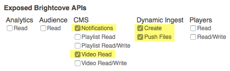

# PHP Wrapper for Brightcove Dynamic Ingest

## About

This project provides a starting point for integrating the Brightcove Dynamic Ingest API into your application. It provides simple ways to add and update videos and associated media using either pull-based ingest or source file upload.

Error handling is not yet implemented.

This code is offered as-is, and is not supported by Brightcove. If you can improve or add to this project, pull requests are welcome.

## Requirements

PHP version 5.4 or greater, including JSON and curl functionality. 

## Installation

1. Download, clone, or fork this repository.
2. Copy the **dist** folder to your local or remote web server - *note: for the wrapper to function properly, you may need to put a physical copy under the web document root, not a symlink. I have gotten it to work with a symlink copy, but can't guarantee that works generally/*

## Authentication

The DI wrapper will fetch necessary access tokens for your requests - you must provide client credentials with permissions adequate for Dynamic Ingest operations. The recommended permissions for your credentials are:

## Testing

You can test the installation by copying the **sample** folder to your web server - it should be placed at the same level of the directory tree as the **dist** folder - e.g.:

{root}>
  - dist
  - sample

Then:

1. Browse to http://yourpath/sample/index.html
2. Enter the necessary account id, client id, and client secret (and video id to test replace or transcode)
3. Select an operation
4. Click submit
5. See the results in Output area

## Known issues

1. The items in the putFiles responses will be empty objects (source file upload requests) - this is a bug I haven't tracked down, but it's not critical - you don't need that information for anything
2. Exception handling is not yet implemented - failures will likely be silent

___

## Examples

### Instantiation

This example shows how to instantiate, or start, the BCDIAPI PHP class. The argument, a JSON string, is required, and must take the form shown here. The recommended permissions for your credentials are:

### Sample code

    <?php

    // Include the BCDIAPI SDK
    require 'path_to_wrapper/bc-diapi.php';

    // account information
    $account_data = '{
        "account_id": "YOUR_ACCOUNT_ID",
        "client_id": "YOUR_CLIENT_ID",
        "client_secret": "YOUR_CLIENT_SECRET"
    }';

    // Instantiate the class, passing it the account information
    $bcdi = new BCDIAPI($account_data);

The parameters for the constructor are:

* [JSON string] `$account_data`

### Ingest request

There is one method to handle ingest requests of all types - only the input data varies for the 5 types of requests:

* ingest a new video (pull-based)
* ingest a new video (using source file upload)
* replace a video (pull-based)
* replace video (using source file upload)
* retrancode a video

#### Method

    $BCDIAPI->ingest_request($ingest_options)

The parameters for the method are:

* [object] `$ingest_options`
    * [JSON string] `$ingest_options->video_options` a JSON string corresponding to the request body for the CMS API request - **required for new videos**
    * [JSON string] `$ingest_options->ingest_options` a JSON string corresponding to the request body for the Dynamic Ingest API request - **required**
    * [JSON string] `$ingest_options->file_paths` a JSON string containing paths to the video, poster, and/or thumbnail files **required** *for source file upload requests only* - see the examples below for the structure
    * [JSON string] `$ingest_options->text_tracks` a JSON string containing paths and other parameters for text tracks *for source file upload requests only* - see the examples below for the structure
    * [string] `$ingest_options->video_id` video id (required for replace/retrancode requests)

Notes:

1. For the `video_options`, see the [API reference](http://docs.brightcove.com/en/video-cloud/di-api/reference/versions/v1/index.html#api-Video-Create_Video_Object) - for new videos, minimal JSON would be `{"name": "My Video Title"}`
2. For the `ingest_options`, see the [API reference](http://docs.brightcove.com/en/video-cloud/di-api/reference/versions/v1/index.html#api-Ingest-Ingest_Media_Asset) and the examples below

Returns:

* [object] the object has 4 members
    * `cms` the CMS API response (for new video ingests)
    * `s3` an array of responses for S3 information requests (source file upload)
    * `putFiles` an array of responses from putting files to S3 (currently the objects are empty - a non-critical bug)
    * `di` the Dynamic Ingest API response

### Examples

Note that the examples below assume the wrapper is already instantiated as `$bcdi`.

#### **Ingest new video (pull-based)**

    // to ingest new video (pull-based)
    $video_metadata = '{"name":"Great Blue Heron - DI Wrapper test","description": "An original nature video","tags": ["nature","bird"]}';
    // pull ingest options
    $pull_ingest_data = '{"profile": "videocloud-default-v1","capture-images": true,"text_tracks": [{"url": "http://solutions.brightcove.com/bcls/assets/vtt/sample.vtt","srclang": "en","kind": "captions","label": "EN","default": true}],"master": {"url": "http://solutions.brightcove.com/bcls/assets/videos/Great_Blue_Heron.mp4"},"callbacks": ["http://solutions.brightcove.com/bcls/di-api/di-callbacks.php"]}';

    $pull_options = new stdClass();
    $pull_options->video_options = $video_metadata;
    $pull_options->ingest_options = $pull_ingest_data;

    // make a request
    $responses = $bcdi->ingest_request($pull_options);

#### **Ingest new video (upload source files)**

    // to ingest new video (upload source files)
    $video_metadata = '{"name":"Great Blue Heron - DI Wrapper test","description": "An // push ingest data
    $push_ingest_data = '{"profile": "videocloud-default-v1","capture-images": false,"callbacks": ["http://solutions.brightcove.com/bcls/di-api/di-callbacks.php"]}';
    $file_paths = '{"video": "../assets/Great-Blue-Heron.mp4","poster": "../assets/Great-Blue-Heron.png","thumbnail": "../assets/great-blue-heron-thumbnail.png"}';
    $text_tracks = '[{"path": "../assets/sample.vtt", "srclang": "en","kind": "captions","label": "EN","default": true}]';

    $push_options = new stdClass();
    $push_options->video_options = $video_metadata;
    $push_options->ingest_options = $push_ingest_data;
    $push_options->file_paths = $file_paths;
    $push_options->text_tracks = $text_tracks;

    // make a request
    $responses = $bcdi->ingest_request($push_options);

#### **Replace video (pull-based)**

    // to replace video (pull-based)
    $video_id = '1234567890';
    $pull_ingest_data = '{"profile": "videocloud-default-v1","capture-images": true,"text_tracks": [{"url": "http://solutions.brightcove.com/bcls/assets/vtt/sample.vtt","srclang": "en","kind": "captions","label": "EN","default": true}],"master": {"url": "http://solutions.brightcove.com/bcls/assets/videos/Great_Blue_Heron.mp4"},"callbacks": ["http://solutions.brightcove.com/bcls/di-api/di-callbacks.php"]}';

    $pull_options = new stdClass();
    $pull_options->video_id = $video_id;
    $pull_options->ingest_options = $pull_ingest_data;

    // make a request
    $responses = $bcdi->ingest_request($push_options);

###### **Replace video (upload source files)**

    // to replace video (upload source files)
    $video_id = '1234567890';
    $push_ingest_data = '{"profile": "videocloud-default-v1","capture-images": false,"callbacks": ["http://solutions.brightcove.com/bcls/di-api/di-callbacks.php"]}';
    $file_paths = '{"video": "../assets/Great-Blue-Heron.mp4","poster": "../assets/Great-Blue-Heron.png","thumbnail": "../assets/great-blue-heron-thumbnail.png"}';
    $text_tracks = '[{"path": "../assets/sample.vtt", "srclang": "en","kind": "captions","label": "EN","default": true}]';

    $push_options = new stdClass();
    $push_options->video_id = $video_id;
    $push_options->ingest_options = $push_ingest_data;
    $push_options->file_paths = $file_paths;
    $push_options->text_tracks = $text_tracks;

    // make a request
    $responses = $bcdi->ingest_request($push_options);

#### **Retranscode video**

    // to ingest new video (pull-based)
    $video_id = '1234567890';
    $retranscode_data = '{"profile": "high-resolution","capture-images": true,"callbacks": ["http://solutions.brightcove.com/bcls/di-api/di-callbacks.php"]}';

    $ingest_options = new stdClass();
    $ingest_options->video_id = $video_id;
    $ingest_options->ingest_options = $push_ingest_data;

    // make a request
    $responses = $bcdi->ingest_request($ingest_options);

## Error Handling

(*work-in-progress - not implemented yet!*)

* * *

### Errors

(*work-in-progress - not implemented yet!*)

